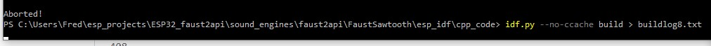

# ESP32 with Faust
 Exploring Digital Sound Processing with Faust on a TTGO TAudio board

## Objective

[Faust]() is a system for Digital Sound Processing (creating digitally synthesized audio). 
 
It takes a sound engine (.dsp) file generated in an GUI or with a text editor and generates C++ code that can be included in a user's project for creation of firmware for sound genrating application.

    

 Recently Faust has been used for an ESP32 based board: [Lilygo TTGO TAudio](). See this [article](/documents/smc20_faust_esp32.pdf) and this [tutorial.](https://faustdoc.grame.fr/tutorials/esp32/)

 More:  
 - [this](https://ccrma.stanford.edu/~rmichon/faustMicro/)
 - [Michon site to be found]()
 - https://github.com/grame-cncm/faust/tree/master-dev/architecture/esp32
 - [Digital Larry's work](https://github.com/HolyCityAudio/ESP32/tree/master/faust)  

 The tutorial contains walktrough examples using either the ESP-IDF environment (cli) or the Arduino IDE.
 
 The **objective of this project** is to learn explore the workflows for creating applications for the ESP32 TTGO TAudio board. The ultimate goal is to:  
 1. contribute to the Faust project in making the faust2api script suitable for ESP32 applications 
 2. create polyphonic sound engines

## Project flow

The faust2api script is a bash script and **requires a Faust environment under Linux**. Setting up this environment is considered treated as a separate project, see the [linux4faust repo](https://github.com/goofy2k/linux4faust).

For maximum flexibility in firmware generation (using the external RAM for large size firmware) the ESP-IDF environment is preferred over the Arduino IDE. Current potential solutions in my linux4faust project do not allow usage of serial ports. So until now firmware flashing **requires ESP-IDF under Windows**.
 
For validation and testing of the Linux environment for Faust preferably in combination with the ESP-IDF environment , a proven set with sound engine (.dsp) and ESP32 user app, workflow must be available. 

### Milestones
1. Faust IDE under Windows: step through the walkthrough in the Faust for ESP32 tutorial  activity OBSOLETE, we can use Faust scripts now  
  a. ESP-IDF  
  b. external RAM with ESP-IDF  
  c. Arduino IDE  
  d. check if external RAM with Arduino IDE is possible
2. faust2esp32 script under Linux (use master-dev branch with ESP32 entry in faust2api, also requires success in linux4faust)
  a. Arduino IDE  
  b. ESP-IDF  
  c. external RAM with ESP-IDF  
  d. ONLY if necessary use Arduino IDE for testing  
3. faust2api script under Linux (use master-dev branch with ESP32 entry in faust2api, also requires success in linux4faust)  
  a. ESP-IDF  
  b. external RAM with ESP-IDF  
  c. ONLY if necessary use Arduino IDE for testing  
4. define the roadmap to polyphony on ESP32 

As we can run Linux scripts now, milestone 1 does not add anything. The Faust IDE is useful for checking audio output of .dsp files. 

### TODO

|  #  | milestone | desrciption                            |    DSP           | Faust script| depends on | status |  
|-----|-----------|----------------------------------------|------------------|-------------|------------|--------|  
|  1  |     *     | design command line scripts            |                  |             |            |started |  
|  2  |     2a    | Arduino sketch                         | FaustSawtooth.dsp| faust2esp32 |            |finished|  
|  3  |     2b    | ESP-IDF tutorial_app1                  | FaustSawtooth.dsp| faust2esp32 |     3      |finished|  
|  4  |     2c    | ESP-IDF tutorial_app2                  | osc.dsp/ext RAM  | faust2esp32 |     4      |   w    | 
|  4  |     2c    | ESP-IDF tutorial_app2                  | FaustSawtooth.dsp| faust2api   |            |build07 | 
|  5  |     3     | ESP-IDF [proposed app](https://github.com/grame-cncm/faust/blob/master-dev/architecture/esp32/esp32.cpp#L159)                | osc.dsp/ext RAM  | faust2esp32 |     4      |   w    |  
|  6  |     4a    | study and evaluate API documentation   |                  | faust2api   |            |   w    |  
|  8  |     4b    | ESP-IDF app with implemented API       | FaustSawtooth.dsp| faust2api   |            |   w    | 
|  8  |     5a    | ESP-IDF app with implemented API       | osc.dsp/ext RAM  | faust2api   |    5,6     |   w    |   
|  9  |     5b    | run sound generation tests with API    | osc.dsp/ext RAM  | faust2api   |     7      |   w    |   

Activities 6,7,8 are the core and will run in improvement cycles  
proposed app:  
- change lines 178  and 179 to use DspFaust object  
- use extern "C" void app_main()  to convert to cpp app  

User experience vs architecture

**Milestone 2a/b**
Follow the tutorial workflow, see:  
- https://faustdoc.grame.fr/tutorials/esp32/
also see:
- main_starter.jpg  
- https://github.com/grame-cncm/faust/blob/master-dev/architecture/esp32/esp32.cpp#L159  replace lines .... and .... 
- look at https://github.com/grame-cncm/faust/tree/master-dev/architecture/esp32 
 
 ## Tutorial workflow
 
 to be done: show final folder structure first
 
  #### Sound engine files
 - Create a .dsp file, put it in the root of the sound_engine folder (so in the parent folder of hello_world

 - Compile the .dsp file with the selected Faust script (faust2esp32 in this example)
   - Open a Powershell window in Windows Terminal
   - Move to the folder containing the .dsp file
   - PS wsl ~/faust/tools/faust2appls/faust2esp32 -h > faustesp32_help.txt    to generate the help for the selected script
   - PS wsl ~/faust/tools/faust2appls/faust2esp32 -lib FaustSawtooth.dsp
   - Copy the 4 files (a .cpp and .h for the sound-engine lib and for the codec driver WM8978) lib to:
     - the main folder of the C++ code
     - the folder containing the Arduino .ino file  

 - Compile the .dsp file with the selected Faust script (faust2esp32 in this example)
From the home (~) in a Linux Window: 
~$ faust2api -esp32 /mnt/c/Users/Fred/esp_projects/ESP32_faust2api/sound_engines/faust2api/FaustSawtooth/FaustSawtooth.dsp
Your dsp-faust.zip API package for ESP32 audio is being created
Package sndfile was not found in the pkg-config search path.
Perhaps you should add the directory containing `sndfile.pc'
to the PKG_CONFIG_PATH environment variable
No package 'sndfile' found

~$ faust2esp32 -lib /mnt/c/Users/Fred/esp_projects/ESP32_faust2api/sound_engines/faust2api/FaustSawtooth/FaustSawtooth.dsp
no further output on screen

 
 #### C++ code
 - copy the ESP-IDF hello_world example integrally to the sound_engine folder, just keep it's name unchanged for now
 - follow the instructions for adaptation of main and CMake files
 - Make sure that the code still compiles
   - Open an ESP-IDF 4.2 Powershell window    (can this be done in WIndows Terminal?)
   - move to the folder containing the folder "main" (so to the parent of folder main) 
   - make sure that the build folder is absent in the parent folder of the main folder
   - PS  idf.py set-target esp32
   - PS idf.py menuconfig (exit without changes for now)
   - PS idf.py build
   - PS idf.py -p COM10 flash
   - PS idf.py -p COM10 monitor 
   

 **REMARK:** create a .gitignore file to prevent that the build folder is uploaded to Github  
 
 - Complete the main.cpp app with the required functionality (as shown in the example):  
   - Include the header files in the top of the file
   - Configure the audio codec
   - Instantiate the Faust DSP Engine
   - Start the Faust DSP Engine
   - Change the sound frequency (dynamically) with the setParamValue function
 - Compile the app again (see above)  
   - FAIL: undefined references to libs.  Change CMakeLists.txt in the ... folder to contain 
     - **idf_component_register(SRCS "main.cpp" "FaustSawtooth.cpp" "WM8978.cpp"**  or
     - **idf_component_register(SRCS "main.cpp" "DspFaust.cpp" "WM8978.cpp"**
   - FAIL:    
     - use **idf.py --no-ccache build**
   - SUCCESS: with warnings about deprecated items (create an issue), but first flash
   - FAIL: started to build again (why?, because of previous no-ccache?)
     - start over again and use no-cache also in the flash command: PS idf.py --no-ccache -p COM10 flash
   - SUCCES ! 
   - Make fimware recognizable to detect if indeed new firmware was flashed: with a version nr printed to the monitor, or better, a sound fingerprint 
     - changed duration of the tones   
    - SUCCES !!!!! new firmware runs OK
   - CHECK REPAIR BY SLETZ: FILES ALREADY IMPORTED  but not deployed OK  see below  
 - Debug until success  **NOT YET** 
 
 #### Arduino code 
 - Full Arduino folder (.ino and libs in one folder works)
 - This implies double storage (and maintenance!!) for the libs
 - find a way to include the libraries with in a different folder than the .ino file. Use relative path in the include statement.  

### Tool learnings

#### ESP-IDF  

Must add .cpp lib files to CMakeLists.txt in main folder

ESP-IDF 4.2 Powershell
from project folder (parent folder of main folder)  
PS idf.py set-target -esp32  
PS idf.py menuconfig  
PS idf.py **--no-ccache** build  
PS idf.py **--no-ccache** -p COM10 flash  
PS idf.py **--no-ccache** -p COM10 monitor  

Use --no-cchache option to prevent build errors with long paths

#### Arduino IDE

- IDE cannot directly handle relative paths for includes, so  
lib files must be in same folder as sketch (.ino)
- IDE cannot handle minus sign in paths. Name all folders accordingly.  
- To make versioning easier, prevent double copies of libs in project tree.  
- Lett ESP-IDF include libs from Arduino sketch folder using relative path and environment variable
for path to root of project  

### Lab log  

**Milestone 7**  
FaustSawtooth and faust2api  
doesn't compile 
may have something to do with long path lengths, see: https://www.esp32.com/viewtopic.php?t=14651  
and informative link therein: https://docs.espressif.com/projects/esp-idf/en/latest/esp32/api-guides/build-system.html#idf-py-options
possible workaround: One way to workaround it is to set env variable ..... IDF_CCACHE_ENABLED='' .... before launching idf.py.
SET  
$Env:<variable-name> = "<new-value>"  
GET  
 
NO SOLUTION !!!
 
 READ THIS:  https://www.cxyzjd.com/article/zhangjingxun12/117095349
 
 has something to do with paths > 90
 
 idf.py --no-ccache build
 
 Now the error becomes:  undefined reference to Libname::function name
 
 In: https://stackoverflow.com/questions/1517138/trying-to-include-a-library-but-keep-getting-undefined-reference-to-messages
 
 The trick here is to put the library AFTER the module you are compiling. The problem is a reference thing. The linker resolves references in order, so when the library is BEFORE the module being compiled, the linker gets confused and does not think that any of the functions in the library are needed. By putting the library AFTER the module, the references to the library in the module are resolved by the linker.

 BUT HOW AND WHERE?
 
 https://stackoverflow.com/questions/67039814/linker-error-in-esp-idf-framework-undefined-reference
 UPDATE THE CMAKE fil
 
 SO ESP-IDF: set env variable CCACH + updated CMAKELists and use nocach in idf.py -nocahce build  (IS THE ENV VAR REQUIRED?  )
 
 Arduino:  'dynamic_cast' not permitted with -fno-rtti  TRY TO DETECT WHERE THE ERROR OCCURS BY COMMENTING OUT CALLS TO THE LIB
 
 It is still there!
 
 sletz: needs to remove the compilation flag -fno-rtti and add -fexception, but I'm not sure you can do that
 
 the other error should be solved:  sletz: This error "error: 'cerr' is not a member of 'std'" should be fixed in this commit https://github.com/grame-cncm/faust/commit/6275eabbde7bc736c69bf44278bd343d27e90f94  
 I imported the active files.  Hope that everything compiles well CHECK CHECK
 
 CHeck this by comparing the uploaded buildlog.txt  with the newly generated buildlog2.txt
 
 The source must be on the windows side!
 
 It is now (?)  .... output in buildlog3.txt
 
 NOTE: sletz repaired the output file of the script file manually. Doe it mean that a script-generated file is also OK????
 
 THe cerr is still there! Do you use the correct source? No have rebuilt faust (Linux)
 
 ### Now get for Arduino:
 ---------------------  
 C:\Users\Fred\esp_projects\ESP32_faust2api\sound_engines\faust2api\FaustSawtooth\arduino\DspFaust.cpp: In member function 'void dsp_voice_group::buildUserInterface(UI*)':
DspFaust.cpp:10886:79: error: 'dynamic_cast' not permitted with -fno-rtti
             if (!fGroupControl || dynamic_cast<SoundUIInterface*>(ui_interface)) {
                                                                               ^
C:\Users\Fred\esp_projects\ESP32_faust2api\sound_engines\faust2api\FaustSawtooth\arduino\DspFaust.cpp: In member function 'virtual void mydsp_poly::buildUserInterface(UI*)':
DspFaust.cpp:11230:59: error: 'dynamic_cast' not permitted with -fno-rtti
             if (dynamic_cast<midi_interface*>(ui_interface)) {
                                                           ^
DspFaust.cpp:11231:74: error: 'dynamic_cast' not permitted with -fno-rtti
                 fMidiHandler = dynamic_cast<midi_interface*>(ui_interface);
                                                                          ^
exit status 1
'dynamic_cast' not permitted with -fno-rtti
---------------------  
 
### Now get for ESP-IDF (see buildlog4.txt):
 ---------------------  
 926/933] Building CXX object esp-idf/main/CMakeFiles/__idf_main.dir/main.cpp.obj
../main/main.cpp: In function 'void app_main()':
../main/main.cpp:28:9: warning: unused variable 'SR' [-Wunused-variable]
     int SR = 48000;
         ^~
../main/main.cpp:29:9: warning: unused variable 'BS' [-Wunused-variable]
     int BS = 8;
         ^~

[928/933] Building CXX object esp-idf/main/CMakeFiles/__idf_main.dir/DspFaust.cpp.obj
FAILED: esp-idf/main/CMakeFiles/__idf_main.dir/DspFaust.cpp.obj 
C:\Users\Fred\.espressif\tools\xtensa-esp32-elf\esp-2020r3-8.4.0\xtensa-esp32-elf\bin\xtensa-esp32-elf-g++.exe  -DHAVE_CONFIG_H -DMBEDTLS_CONFIG_FILE=\"mbedtls/esp_config.h\" -DUNITY_INCLUDE_CONFIG_H -DWITH_POSIX -Iconfig -IC:/Users/Fred/esp-idf/components/newlib/platform_include -IC:/Users/Fred/esp-idf/components/freertos/include -IC:/Users/Fred/esp-idf/components/freertos/xtensa/include -IC:/Users/Fred/esp-idf/components/heap/include -IC:/Users/Fred/esp-idf/components/log/include -IC:/Users/Fred/esp-idf/components/lwip/include/apps -IC:/Users/Fred/esp-idf/components/lwip/include/apps/sntp -IC:/Users/Fred/esp-idf/components/lwip/lwip/src/include -IC:/Users/Fred/esp-idf/components/lwip/port/esp32/include -IC:/Users/Fred/esp-idf/components/lwip/port/esp32/include/arch -IC:/Users/Fred/esp-idf/components/soc/src/esp32/. -IC:/Users/Fred/esp-idf/components/soc/src/esp32/include -IC:/Users/Fred/esp-idf/components/soc/include -IC:/Users/Fred/esp-idf/components/esp_rom/include -IC:/Users/Fred/esp-idf/components/esp_common/include -IC:/Users/Fred/esp-idf/components/esp_system/include -IC:/Users/Fred/esp-idf/components/xtensa/include -IC:/Users/Fred/esp-idf/components/xtensa/esp32/include -IC:/Users/Fred/esp-idf/components/esp32/include -IC:/Users/Fred/esp-idf/components/driver/include -IC:/Users/Fred/esp-idf/components/driver/esp32/include -IC:/Users/Fred/esp-idf/components/esp_ringbuf/include -IC:/Users/Fred/esp-idf/components/efuse/include -IC:/Users/Fred/esp-idf/components/efuse/esp32/include -IC:/Users/Fred/esp-idf/components/espcoredump/include -IC:/Users/Fred/esp-idf/components/esp_timer/include -IC:/Users/Fred/esp-idf/components/esp_ipc/include -IC:/Users/Fred/esp-idf/components/soc/soc/esp32/include -IC:/Users/Fred/esp-idf/components/soc/soc/esp32/../include -IC:/Users/Fred/esp-idf/components/soc/soc/esp32/private_include -IC:/Users/Fred/esp-idf/components/vfs/include -IC:/Users/Fred/esp-idf/components/esp_wifi/include -IC:/Users/Fred/esp-idf/components/esp_wifi/esp32/include -IC:/Users/Fred/esp-idf/components/esp_event/include -IC:/Users/Fred/esp-idf/components/esp_netif/include -IC:/Users/Fred/esp-idf/components/esp_eth/include -IC:/Users/Fred/esp-idf/components/tcpip_adapter/include -IC:/Users/Fred/esp-idf/components/app_trace/include -IC:/Users/Fred/esp-idf/components/mbedtls/port/include -IC:/Users/Fred/esp-idf/components/mbedtls/mbedtls/include -IC:/Users/Fred/esp-idf/components/mbedtls/esp_crt_bundle/include -IC:/Users/Fred/esp-idf/components/bootloader_support/include -IC:/Users/Fred/esp-idf/components/app_update/include -IC:/Users/Fred/esp-idf/components/spi_flash/include -IC:/Users/Fred/esp-idf/components/wpa_supplicant/include -IC:/Users/Fred/esp-idf/components/wpa_supplicant/port/include -IC:/Users/Fred/esp-idf/components/wpa_supplicant/include/esp_supplicant -IC:/Users/Fred/esp-idf/components/nvs_flash/include -IC:/Users/Fred/esp-idf/components/pthread/include -IC:/Users/Fred/esp-idf/components/perfmon/include -IC:/Users/Fred/esp-idf/components/asio/asio/asio/include -IC:/Users/Fred/esp-idf/components/asio/port/include -IC:/Users/Fred/esp-idf/components/cbor/port/include -IC:/Users/Fred/esp-idf/components/coap/port/include -IC:/Users/Fred/esp-idf/components/coap/port/include/coap -IC:/Users/Fred/esp-idf/components/coap/libcoap/include -IC:/Users/Fred/esp-idf/components/coap/libcoap/include/coap2 -IC:/Users/Fred/esp-idf/components/console -IC:/Users/Fred/esp-idf/components/nghttp/port/include -IC:/Users/Fred/esp-idf/components/nghttp/nghttp2/lib/includes -IC:/Users/Fred/esp-idf/components/esp-tls -IC:/Users/Fred/esp-idf/components/esp_adc_cal/include -IC:/Users/Fred/esp-idf/components/esp_gdbstub/include -IC:/Users/Fred/esp-idf/components/esp_hid/include -IC:/Users/Fred/esp-idf/components/tcp_transport/include -IC:/Users/Fred/esp-idf/components/esp_http_client/include -IC:/Users/Fred/esp-idf/components/esp_http_server/include -IC:/Users/Fred/esp-idf/components/esp_https_ota/include -IC:/Users/Fred/esp-idf/components/protobuf-c/protobuf-c -IC:/Users/Fred/esp-idf/components/protocomm/include/common -IC:/Users/Fred/esp-idf/components/protocomm/include/security -IC:/Users/Fred/esp-idf/components/protocomm/include/transports -IC:/Users/Fred/esp-idf/components/mdns/include -IC:/Users/Fred/esp-idf/components/esp_local_ctrl/include -IC:/Users/Fred/esp-idf/components/sdmmc/include -IC:/Users/Fred/esp-idf/components/esp_serial_slave_link/include -IC:/Users/Fred/esp-idf/components/esp_websocket_client/include -IC:/Users/Fred/esp-idf/components/expat/expat/expat/lib -IC:/Users/Fred/esp-idf/components/expat/port/include -IC:/Users/Fred/esp-idf/components/wear_levelling/include -IC:/Users/Fred/esp-idf/components/fatfs/diskio -IC:/Users/Fred/esp-idf/components/fatfs/vfs -IC:/Users/Fred/esp-idf/components/fatfs/src -IC:/Users/Fred/esp-idf/components/freemodbus/common/include -IC:/Users/Fred/esp-idf/components/idf_test/include -IC:/Users/Fred/esp-idf/components/idf_test/include/esp32 -IC:/Users/Fred/esp-idf/components/jsmn/include -IC:/Users/Fred/esp-idf/components/json/cJSON -IC:/Users/Fred/esp-idf/components/libsodium/libsodium/src/libsodium/include -IC:/Users/Fred/esp-idf/components/libsodium/port_include -IC:/Users/Fred/esp-idf/components/mqtt/esp-mqtt/include -IC:/Users/Fred/esp-idf/components/openssl/include -IC:/Users/Fred/esp-idf/components/spiffs/include -IC:/Users/Fred/esp-idf/components/ulp/include -IC:/Users/Fred/esp-idf/components/unity/include -IC:/Users/Fred/esp-idf/components/unity/unity/src -IC:/Users/Fred/esp-idf/components/wifi_provisioning/include -mlongcalls -Wno-frame-address   -ffunction-sections -fdata-sections -fstrict-volatile-bitfields -Wall -Werror=all -Wno-error=unused-function -Wno-error=unused-but-set-variable -Wno-error=unused-variable -Wno-error=deprecated-declarations -Wextra -Wno-unused-parameter -Wno-sign-compare -ggdb -Og -std=gnu++11 -fno-exceptions -fno-rtti -D_GNU_SOURCE -DIDF_VER=\"v4.2-dirty\" -DESP_PLATFORM -MD -MT esp-idf/main/CMakeFiles/__idf_main.dir/DspFaust.cpp.obj -MF esp-idf\main\CMakeFiles\__idf_main.dir\DspFaust.cpp.obj.d -o esp-idf/main/CMakeFiles/__idf_main.dir/DspFaust.cpp.obj -c ../main/DspFaust.cpp
../main/DspFaust.cpp: In function 'void buildUIGlue(UIGlue*, UI*, bool)':
../main/DspFaust.cpp:1062:101: warning: cast between incompatible function types from 'void (*)(void*, const char*, double*, double, double, double, double)' to 'addVerticalSliderFun' {aka 'void (*)(void*, const char*, float*, float, float, float, float)'} [-Wcast-function-type]
         glue->addVerticalSlider = reinterpret_cast<addVerticalSliderFun>(addVerticalSliderGlueDouble);
                                                                                                     ^
../main/DspFaust.cpp:1063:107: warning: cast between incompatible function types from 'void (*)(void*, const char*, double*, double, double, double, double)' to 'addHorizontalSliderFun' {aka 'void (*)(void*, const char*, float*, float, float, float, float)'} [-Wcast-function-type]
         glue->addHorizontalSlider = reinterpret_cast<addHorizontalSliderFun>(addHorizontalSliderGlueDouble);
                                                                                                           ^
../main/DspFaust.cpp:1064:83: warning: cast between incompatible function types from 'void (*)(void*, const char*, double*, double, double, double, double)' to 'addNumEntryFun' {aka 'void (*)(void*, const char*, float*, float, float, float, float)'} [-Wcast-function-type]
         glue->addNumEntry = reinterpret_cast<addNumEntryFun>(addNumEntryGlueDouble);
                                                                                   ^
../main/DspFaust.cpp:1065:113: warning: cast between incompatible function types from 'void (*)(void*, const char*, double*, double, double)' to 'addHorizontalBargraphFun' {aka 'void (*)(void*, const char*, float*, float, float)'} [-Wcast-function-type]
         glue->addHorizontalBargraph = reinterpret_cast<addHorizontalBargraphFun>(addHorizontalBargraphGlueDouble);
                                                                                                                 ^
../main/DspFaust.cpp:1066:107: warning: cast between incompatible function types from 'void (*)(void*, const char*, double*, double, double)' to 'addVerticalBargraphFun' {aka 'void (*)(void*, const char*, float*, float, float)'} [-Wcast-function-type]
         glue->addVerticalBargraph = reinterpret_cast<addVerticalBargraphFun>(addVerticalBargraphGlueDouble);
                                                                                                           ^
../main/DspFaust.cpp: In member function 'void dsp_voice_group::buildUserInterface(UI*)':
../main/DspFaust.cpp:10886:79: error: 'dynamic_cast' not permitted with -fno-rtti
             if (!fGroupControl || dynamic_cast<SoundUIInterface*>(ui_interface)) {
                                                                               ^
../main/DspFaust.cpp: In member function 'virtual void mydsp_poly::buildUserInterface(UI*)':
../main/DspFaust.cpp:11230:59: error: 'dynamic_cast' not permitted with -fno-rtti
             if (dynamic_cast<midi_interface*>(ui_interface)) {
                                                           ^
../main/DspFaust.cpp:11231:74: error: 'dynamic_cast' not permitted with -fno-rtti
                 fMidiHandler = dynamic_cast<midi_interface*>(ui_interface);
                                                                          ^
../main/DspFaust.cpp: In constructor 'esp32audio::esp32audio(int, int)':
../main/DspFaust.cpp:17974:61: warning: 'I2S_COMM_FORMAT_I2S' is deprecated [-Wdeprecated-declarations]
                 .communication_format = (i2s_comm_format_t)(I2S_COMM_FORMAT_I2S | I2S_COMM_FORMAT_I2S_MSB),
                                                             ^~~~~~~~~~~~~~~~~~~
In file included from C:/Users/Fred/esp-idf/components/soc/src/esp32/include/hal/i2s_ll.h:30,
                 from C:/Users/Fred/esp-idf/components/soc/include/hal/i2s_hal.h:28,
                 from C:/Users/Fred/esp-idf/components/driver/include/driver/i2s.h:24,
                 from ../main/DspFaust.cpp:17804:
C:/Users/Fred/esp-idf/components/soc/include/hal/i2s_types.h:70:5: note: declared here
     I2S_COMM_FORMAT_I2S       __attribute__((deprecated)) = 0x01, /*!< I2S communication format I2S, correspond to `I2S_COMM_FORMAT_STAND_I2S`*/
     ^~~~~~~~~~~~~~~~~~~
../main/DspFaust.cpp:17974:83: warning: 'I2S_COMM_FORMAT_I2S_MSB' is deprecated [-Wdeprecated-declarations]
                 .communication_format = (i2s_comm_format_t)(I2S_COMM_FORMAT_I2S | I2S_COMM_FORMAT_I2S_MSB),
                                                                                   ^~~~~~~~~~~~~~~~~~~~~~~
In file included from C:/Users/Fred/esp-idf/components/soc/src/esp32/include/hal/i2s_ll.h:30,
                 from C:/Users/Fred/esp-idf/components/soc/include/hal/i2s_hal.h:28,
                 from C:/Users/Fred/esp-idf/components/driver/include/driver/i2s.h:24,
                 from ../main/DspFaust.cpp:17804:
C:/Users/Fred/esp-idf/components/soc/include/hal/i2s_types.h:71:5: note: declared here
     I2S_COMM_FORMAT_I2S_MSB   __attribute__((deprecated)) = 0x01, /*!< I2S format MSB, (I2S_COMM_FORMAT_I2S |I2S_COMM_FORMAT_I2S_MSB) correspond to `I2S_COMM_FORMAT_STAND_I2S`*/
     ^~~~~~~~~~~~~~~~~~~~~~~
../main/DspFaust.cpp:17979:13: warning: missing initializer for member 'i2s_config_t::tx_desc_auto_clear' [-Wmissing-field-initializers]
             };
             ^
../main/DspFaust.cpp:17979:13: warning: missing initializer for member 'i2s_config_t::fixed_mclk' [-Wmissing-field-initializers]
../main/DspFaust.cpp: In constructor 'DspFaust::DspFaust(bool)':
../main/DspFaust.cpp:24963:26: error: exception handling disabled, use -fexceptions to enable
     throw std::bad_alloc();
                          ^
../main/DspFaust.cpp: At global scope:
../main/DspFaust.cpp:1248:13: warning: 'void buildManagerGlue(MemoryManagerGlue*, dsp_memory_manager*)' defined but not used [-Wunused-function]
 static void buildManagerGlue(MemoryManagerGlue* glue, dsp_memory_manager* manager)
             ^~~~~~~~~~~~~~~~
../main/DspFaust.cpp:1226:13: warning: 'void buildMetaGlue(MetaGlue*, Meta*)' defined but not used [-Wunused-function]
 static void buildMetaGlue(MetaGlue* glue, Meta* meta)
             ^~~~~~~~~~~~~
../main/DspFaust.cpp:1051:13: warning: 'void buildUIGlue(UIGlue*, UI*, bool)' defined but not used [-Wunused-function]
 static void buildUIGlue(UIGlue* glue, UI* ui_interface, bool is_double)
             ^~~~~~~~~~~
../main/DspFaust.cpp:162:20: warning: 'std::__cxx11::string pathToContent(const string&)' defined but not used [-Wunused-function]
 static std::string pathToContent(const std::string& path)
                    ^~~~~~~~~~~~~
../main/DspFaust.cpp:156:13: warning: 'bool isopt(char**, const char*)' defined but not used [-Wunused-function]
 static bool isopt(char* argv[], const char* name)
             ^~~~~
../main/DspFaust.cpp:146:20: warning: 'const char* lopts1(int, char**, const char*, const char*, const char*)' defined but not used [-Wunused-function]
 static const char* lopts1(int argc, char* argv[], const char* longname, const char* shortname, const char* def)
                    ^~~~~~
../main/DspFaust.cpp:140:20: warning: 'const char* lopts(char**, const char*, const char*)' defined but not used [-Wunused-function]
 static const char* lopts(char* argv[], const char* name, const char* def)
                    ^~~~~
../main/DspFaust.cpp:130:13: warning: 'long int lopt1(int, char**, const char*, const char*, long int)' defined but not used [-Wunused-function]
 static long lopt1(int argc, char* argv[], const char* longname, const char* shortname, long def)
             ^~~~~
../main/DspFaust.cpp:124:13: warning: 'long int lopt(char**, const char*, long int)' defined but not used [-Wunused-function]
 static long lopt(char* argv[], const char* name, long def)
             ^~~~
../main/DspFaust.cpp:122:12: warning: 'int int2pow2(int)' defined but not used [-Wunused-function]
 static int int2pow2(int x) { int r = 0; while ((1<<r) < x) r++; return r; }
            ^~~~~~~~
../main/DspFaust.cpp:120:12: warning: 'int lsr(int, int)' defined but not used [-Wunused-function]
 static int lsr(int x, int n) { return int(((unsigned int)x) >> n); }
            ^~~
 
 
 
 
  ---------------------  
 
 Both platforms have a 'dynamic_cast' not permitted with -fno-rtti error
 Arduino  
 DspFaust.cpp:10886:79:  
 DspFaust.cpp:11230:59:  
 DspFaust.cpp:11231:74:   
 
 https://stackoverflow.com/questions/8469900/cant-downcast-because-class-is-not-polymorphic  
 RTTI = run-time type information (RTTI)  
 https://stackoverflow.com/questions/4486609/when-can-compiling-c-without-rtti-cause-problems  !!!  
 
 COMPILER OPTION FOR RTTI:    CONFIG_COMPILER_CXX_RTTI where to use ?  
 https://docs.espressif.com/projects/esp-idf/en/latest/esp32/api-reference/kconfig.html#config-compiler-cxx-rtti
 in sdkconfig  
 set CONFIG_COMPILER_CXX_RTTI=y    
 
 NOTE this is removed again after running idf.py set-target esp32
 enable it again before running build
 buildlog5.txt
 
 CONFIG_CXX_EXCEPTIONS=y in sdkconfig
 https://esp32.com/viewtopic.php?t=8575
 
  
### **make it "hard" with menuconfig?** in Compiler options 
 https://docs.espressif.com/projects/esp-idf/en/latest/esp32/api-reference/kconfig.html#config-cxx-exceptions
 
 
 
 success buildlog7.txt success!! 
 
 instantiated AND started lib >runtime error heap error
 
 instantiate only:  buildlog8.txt
 buildlog8.txt
 command line now looks:
 
 
 ## Toggle logging run-time output with ctrl L
 
 functions:  
 - dynamic_cast    
 - throw  
 require? compiler options:
 - CONFIG_CXX_EXCEPTIONS=y
 - CONFIG_COMPILER_CXX_RTTI=y  
 lead to runtime errors: ?    
 - run time error at only instantiating DspFaust:  CORRUPT HEAP: multi_heap.c:439 detected at 0x3ffb4960  
 # RESULT
 OK.  When I toggle the exception handling (without consequences for the throw call, because it is commented out,  the runtime HEAP ERROR stays. Conclusion: we can safely enable exception handling (CONFIG_COMPILER_CXX_EXCEPTIONS=y in sdkconfig) and use the throw call in line 24963 of DspFaust.cpp.
#COMMENTED OUT THE DYNAMIC_CASTS
 
 HEAP_ERROR may have disappeared by setting buffer size to 32 (was 8, should be minimal 8).
 
 Get some Sawtooth sound when mono frequency is set to 440 Hz  
 Reboot after a fraction of a second  
 See images with boot info and post-mortem info  after build 26  
 It is about:  lock_acquire_generic  in locks.c   line nr 142 :  
 **Tried to block on mutex from ISR, couldn't... rewrite your program to avoid libc interactions in ISRs!**  
 It is about freertos, semaphore mutexes. Have to read about that! Have to know how freertos and tasking works...
 
 
 Last references point at JSONUI in DspFaust......
 
 #### Issue solved by commenting out the line MidiMeta::analyse(mono_dsp, midi_sync, nvoices); (around line 11644 in DspFaust.cpp)
 This is in the instatiation part of the sound machine.
 Apparently I can do without
 
 #### Testing some API calls:
 
 -- DSP->isRunning()  OK
 
 # Faust API

This API allows to interact with a Faust object and its associated audio engine at a high level. The idea is that all the audio part of the app is implemented in Faust allowing developers to focus on the design of the application itself. 

### Application Set-Up

Import `DspFaust.h` and `DspFaust.cpp` in your project (this can be done simply by dragging these files in your project tree). Then, import `DspFaust.h` (`#include "DspFaust.h"`) in the file where you want to create/control the Faust object. 

### Using the C++ API

The current Faust API is designed to seamlessly integrate to the life cycle of an app. It is accessible through a single `DspFaust` object. The constructor of that object is used to set the sampling rate and the buffer size:

	DspFaust* dspFaust = new DspFaust(SR, BS);

The `start()` method is used to start the audio computing. Similarly, `stop()` can be called to stop the audio computing.

It is possible to interact with the different parameters of the Faust object by using the `setParamValue` method. Two versions of this method exist: one where the parameter can be selected by its address and one where it can be selected using its ID. The [Parameters List](#parameters-list) section gives a list of the addresses and corresponding IDs of the current Faust object.

If your Faust object is polyphonic (e.g. if you used the `-nvoices` option when generating this API), then you can use the MIDI polyphony methods like `keyOn`, `keyOff`, etc.

It is possible to change the parameters of polyphonic voices independently using the `setVoiceParamValue` method. This method takes as one of its arguments the address to the voice returned by `keyOn` or `newVoice` when it is called. E.g:

	uintptr_t voiceAddress = dspFaust->keyOn(70, 100);
	dspFaust->setVoiceParamValue(1, voiceAddress, 214);
	dspFaust->keyOff(70);
	
In the example above, a new note is created and its parameter ID 1 is modified. This note is then terminated. Note that parameters addresses (path) are different for independent voices than when using `setParamValue`. The list of these addresses is provided in a separate sub-section of the [Parameters List](#parameters-list) section.

Finally, note that new voices don't necessarily have to be created using `keyOn`. Indeed, you might choose to just use the `newVoice` method for that:

	uintptr_t voiceAddress = dspFaust->newVoice();
	dspFaust->setVoiceParamValue(1, voiceAddress, 214);
	dspFaust->deleteVoice(voiceAddress);

This is particularly useful when making applications where each finger of the user is an independent sound that doesn't necessarily has a pitch.

In case you would like to use the built-in accelerometer or gyroscope of your device to control some of the parameters of your Faust object, all you have to do is to send the raw accelerometer data to it by using the `propagateAcc` or `propagateGyr` for the gyroscope. After that, mappings can be configured directly from the Faust code using [this technique](#using-built-in-sensors-to-control-parameters) or using the `setAccConverter` and `setGyrConverter` method.

## Parameters List

### Main Parameters

* **0**: `/FaustSawtooth/freq`
* **1**: `/FaustSawtooth/gain`

## API Reference

### `DspFaust(bool auto_connect = true)`
Default constructor, to be used wih audio drivers that impose their sample rate and buffer size (like JACK and JUCE).

#### Arguments

* `auto_connect`: whether to automatically connect audio outpus to the hardware (usable with JACK)

---

### `DspFaust(int SR, int BS, bool auto_connect = true)`
Constructor.

#### Arguments

* `SR`: sampling rate

* `BS`: buffer size

* `auto_connect`: whether to automatically connect audio outputs to the hardware (usable with JACK)

---

### `DspFaust(const string& dsp_content, int SR, int BS, bool auto_connect = true)`
Constructor.

#### Arguments

* `dsp_content`: the DSP as a file or string

* `SR`: sampling rate

* `BS`: buffer size

* `auto_connect`: whether to automatically connect audio outputs to the hardware (usable with JACK)

---

### `bool start()`
Start the audio processing.   :white_check_mark:

Returns `true` if successful and `false` if not.

---

### `void stop()`
Stop the audio processing.

---

### `bool isRunning()`
Returns `true` if audio is running.   :white_check_mark:

---

### `long keyOn(int pitch, int velocity)`
Instantiate a new polyphonic voice. This method can

only be used if the `[style:poly]` metadata is used in

the Faust code or if the `-nvoices` flag has been

provided before compilation.

`keyOn` will return 0 if the Faust object is not

polyphonic or the address to the allocated voice as

an `uintptr_t` otherwise. This value can be used later with

[`setVoiceParamValue`](#setvoiceparamvalue) or

[`getVoiceParamValue`](#getvoiceparamvalue) to access

the parameters of a specific voice.

#### Arguments

* `pitch`: MIDI note number (0-127)

* `velocity`: MIDI velocity (0-127)

---

### `int keyOff(int pitch)`
De-instantiate a polyphonic voice. This method can

only be used if the `[style:poly]` metadata is used in

the Faust code or if the `-nvoices` flag has been

provided before compilation.

`keyOff` will return 0 if the object is not polyphonic

and 1 otherwise.

#### Arguments

* `pitch`: MIDI note number (0-127), should be the same

as the one used for `keyOn`

---

### `uintptr_t newVoice()`
Instantiate a new polyphonic voice. This method can

only be used if the `[style:poly]` metadata is used in

the Faust code or if `-nvoices` flag has been

provided before compilation.

`newVoice` will return 0 if the Faust object is not

polyphonic or the address to the allocated voice as

a `uintptr_t` otherwise. This value can be used later with

`setVoiceParamValue`, `getVoiceParamValue` or

`deleteVoice` to access the parameters of a specific

voice.

---

### `int deleteVoice(uintptr_t voice)`
De-instantiate a polyphonic voice. This method can

only be used if the `[style:poly]` metadata is used in

the Faust code or if `-nvoices` flag has been

provided before compilation.

`deleteVoice` will return 0 if the object is not polyphonic

and 1 otherwise.

#### Arguments

* `voice`: the address of the voice given by `newVoice`

---

### `void allNotesOff(bool hard = false)`
Terminates all the active voices, gently (with release when hard = false or immediately when hard = true).

---

### `void propagateMidi(int count, double time, int type, int channel, int data1, int data2)`
Take a raw MIDI message and propagate it to the Faust

DSP object. This method can be used concurrently with

[`keyOn`](#keyOn) and [`keyOff`](#keyOff).

`propagateMidi` can

only be used if the `[style:poly]` metadata is used in

the Faust code or if `-nvoices` flag has been

provided before compilation.

#### Arguments

* `count`: size of the message (1-3)

* `time`: time stamp

* `type`: message type (byte)

* `channel`: channel number

* `data1`: first data byte (should be `null` if `count<2`)

* `data2`: second data byte (should be `null` if `count<3`)

---

### `const char* getJSONUI()`
Returns the JSON description of the UI of the Faust object.

---

### `const char* getJSONMeta()`
Returns the JSON description of the metadata of the Faust object.

---

### `void buildUserInterface(UI* ui_interface)`
Calls the polyphonic or monophonic buildUserInterface with the ui_interface parameter.

#### Arguments

* `ui_interface`: an UI* object

---

### `int getParamsCount()`
Returns the number of parameters of the Faust object.

---

### `void setParamValue(const char* address, float value)`
Set the value of one of the parameters of the Faust

object in function of its address (path).

#### Arguments

* `address`: address (path) of the parameter

* `value`: value of the parameter

---

### `void setParamValue(int id, float value)`
Set the value of one of the parameters of the Faust

object in function of its id.

#### Arguments

* `id`: id of the parameter

* `value`: value of the parameter

---

### `float getParamValue(const char* address)`
Returns the value of a parameter in function of its

address (path).

#### Arguments

* `address`: address (path) of the parameter

---

### `float getParamValue(int id)`
Returns the value of a parameter in function of its

id.

#### Arguments

* `id`: id of the parameter

---

### `void setVoiceParamValue(const char* address, uintptr_t voice, float value)`
Set the value of one of the parameters of the Faust

object in function of its address (path) for a

specific voice.

#### Arguments

* `address`: address (path) of the parameter

* `voice`: address of the polyphonic voice (retrieved

from `keyOn`

* `value`: value of the parameter

---

### `void setVoiceParamValue(int id, uintptr_t voice, float value)`
Set the value of one of the parameters of the Faust

object in function of its id for a

specific voice.

#### Arguments

* `id`: id of the parameter

* `voice`: address of the polyphonic voice (retrieved

from `keyOn`

* `value`: value of the parameter

---

### `float getVoiceParamValue(const char* address, uintptr_t voice)`
Returns the value of a parameter in function of its

address (path) for a specific voice.

#### Arguments

* `address`: address (path) of the parameter

* `voice`: address of the polyphonic voice (retrieved

from `keyOn`)

---

### `float getVoiceParamValue(int id, uintptr_t voice)`
Returns the value of a parameter in function of its

id for a specific voice.

#### Arguments

* `id`: id of the parameter

* `voice`: address of the polyphonic voice (retrieved

from `keyOn`)

---

### `const char* getParamAddress(int id)`
Returns the address (path) of a parameter in function

of its ID.

#### Arguments

* `id`: id of the parameter

---

### `const char* getVoiceParamAddress(int id, uintptr_t voice)`
Returns the address (path) of a parameter in function

of its ID.

#### Arguments

* `id`: id of the parameter

* `voice`: address of the polyphonic voice (retrieved

from `keyOn`)

---

### `float getParamMin(const char* address)`
Returns the minimum value of a parameter in function of

its address (path).

#### Arguments

* `address`: address (path) of the parameter

---

### `float getParamMin(int id)`
Returns the minimum value of a parameter in function

of its ID.

#### Arguments

* `id`: id of the parameter

---

### `float getParamMax(const char* address)`
Returns the maximum value of a parameter in function of

its address (path).

#### Arguments

* `address`: address (path) of the parameter

---

### `float getParamMax(int id)`
Returns the maximum value of a parameter in function

of its ID.

#### Arguments

* `id`: id of the parameter

---

### `float getParamInit(const char* address)`
Returns the default value of a parameter in function of

its address (path).

#### Arguments

* `address`: address (path) of the parameter

---

### `float getParamInit(int id)`
Returns the default value of a parameter in function

of its ID.

#### Arguments

* `id`: id of the parameter

---

### `const char* getMetadata(const char* address, const char* key)`
Returns the metadataof a parameter in function of

its address (path) and the metadata key.

#### Arguments

* `address`: address (path) of the parameter

* `key`: the metadata key

---

### `const char* getMetadata(int id, const char* key)`
Returns the metadataof a parameter in function of

its iD and the metadata key.

#### Arguments

* `id`: id of the parameter

* `key`: the metadata key

---

### `void propagateAcc(int acc, float v)`
Propagate the RAW value of a specific accelerometer

axis to the Faust object.

#### Arguments

* `acc`: the accelerometer axis (**0**: x, **1**: y, **2**: z)

* `v`: the RAW acceleromter value in m/s

---

### `void setAccConverter(int p, int acc, int curve, float amin, float amid, float amax)`
Set the conversion curve for the accelerometer.

#### Arguments

* `id`: the UI parameter id

* `acc`: the accelerometer axis (**0**: x, **1**: y, **2**: z)

* `curve`: the curve (**0**: up, **1**: down, **2**: up and down)

* `amin`: mapping min point

* `amid`: mapping middle point

* `amax`: mapping max point

---

### `void propagateGyr(int gyr, float v)`
Propagate the RAW value of a specific gyroscope

axis to the Faust object.

#### Arguments

* `gyr`: the gyroscope axis (**0**: x, **1**: y, **2**: z)

* `v`: the RAW accelerometer value in m/s

---

### `void setGyrConverter(int p, int gyr, int curve, float amin, float amid, float amax)`
Set the conversion curve for the gyroscope.

#### Arguments

* `id`: the UI parameter id

* `gyr`: the gyroscope axis (**0**: x, **1**: y, **2**: z)

* `curve`: the curve (**0**: up, **1**: down, **2**: up and down)

* `amin`: mapping min point

* `amid`: mapping middle point

* `amax`: mapping max point

---

### `float getCPULoad()`
Returns the CPU load (between 0 and 1.0).

---

### `void configureOSC(int xmit, int inport, int outport, int errport, const char* address)`
Change the OSC configuration.

#### Arguments

* `xmit`: the xmit state (off-0 all-1 alias-2)

* `inport`: the input port number

* `outport`: the output port number

* `errport`: the error port number

* `address`: the destination IP address

---

### `bool isOSCOn()`
Return OSC Status.

---

 
 
 
 
 ....
   
#### THERE IS A PROBLEM IN ARDUINO WITH RELATIVE PATHS FOR LIB INCLUDES
#### PUT THE LIBS IN THE SAME FOLDER AS THE .INO FILE AND INCLUDE BETWEEN "   "
#### TRY TO USE RELATIVE INCLUDES IN THE C++ CODE 
#### THIS PREVENTS THAT YOU HAVE TO MAINTAIN TWO VERSIONS FOR EACH LIB SYNCED
#### DRAW THE FOLDER STRUCTURE BEFOR YOU IMPLEMENT A SOLUTION

## Further tooling

**logging of script output for easier of line study of results

**script command lines**  
create batch files?  
In target folder:  
wsl ~/faust/tools/faust2appls/faust2esp32 -h > faust2esp32_help.txt
 
PS C:\Users\Fred\esp_projects\ESP32-with-Faust\sound_engines\FaustSawtooth\cpp\faust2esp32> wsl ~/faust/tools/faust2appls/faust2esp32 ../../FaustSawtooth.dsp  
PS C:\Users\Fred\esp_projects\ESP32-with-Faust\sound_engines\FaustSawtooth\cpp\faust2esp32> wsl ~/faust/tools/faust2appls/faust2esp32 - > faustesp32_help.txt

 ** folder structure generator  https://ascii-tree-generator.com/
 
 
   
 
 sound_engines/..................a sound engine's configuration is defined by: Faust script, .dsp file   
├─ faust2api/....................each sound engine is implemented in a cpp_code and an arduino_sketch  
│  ├─ DSPTemplate/  
│  ├─ FaustSawtooth/   
│  │  ├─ FaustSawtooth.dsp  
│  │  ├─ arduino_sketch/  
│  │  │  ├─ arduino_sketch.ino  
│  │  │  ├─ DspFaust.cpp........lib files have to be stored in 2 places (Arduino does not accept relative paths)  
│  │  │  ├─ DspFaust.h               
│  │  │  ├─ WM8978.cpp  
│  │  │  ├─ WM8978.h  
│  │  ├─ cpp_code/  
│  │  │  ├─ main/  
│  │  │  │  ├─ main.cpp  
│  │  │  │  ├─ CMake_stuff  
│  │  │  │  ├─ DspFaust.cpp....must implement relative path to arduino_sketch folder for the libs to prevent double maintenance (risky version control)   
│  │  │  │  ├─ DspFaust.h  
│  │  │  │  ├─ WM8978.cpp  
│  │  │  │  ├─ WM8978.h  
│  │  │  ├─ CMake_stuff    
├─ faust2esp32/  
│  ├─ DSPTemplate/  
│  ├─ FaustSawtooth/  
│  ├─ another_dsp/  
│  │  ├─ another_dsp.dsp  

#### Also check:  
- https://www.makeuseof.com/tag/5-ways-to-print-folder-and-directory-contents-in-windows/  
- https://www.thewindowsclub.com/how-to-create-a-folder-tree-in-windows-10  
 
 
 
 
 
 

## MELODIES IMPLEMENT IN ARDUINO SAWTOOTH
 
https://www.browncountylibrary.org/wp-content/uploads/2018/03/arduino_piezo.pdf
 e.g.  
 int numTones = 10; // the number of tones in the scale  
int tones[] = {261, 277, 294, 311, 330, 349, 370, 392, 415, 440}; // the frequency for each tone  
// mid C C# D D# E F F# G G# A  

